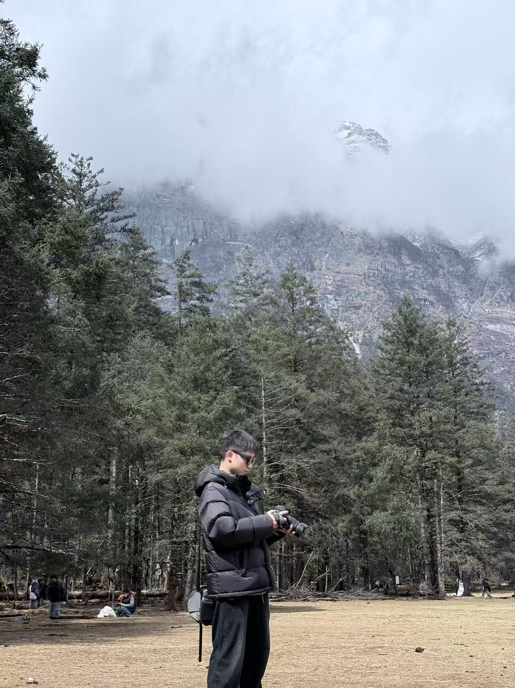
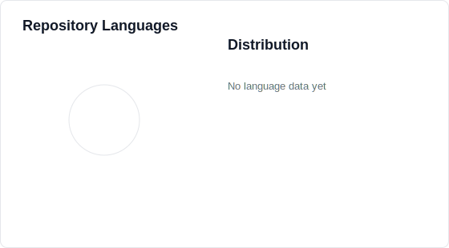
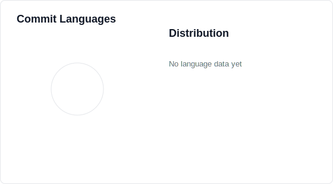
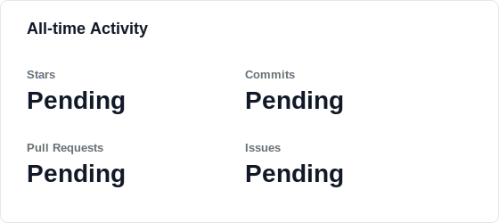
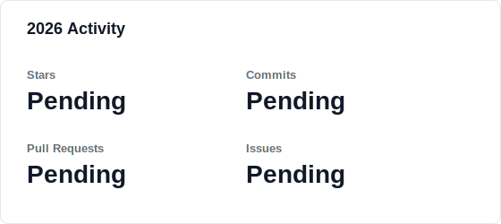

  

  # Hi, I'm Jvle(Keke Ming)

  **Systems & Security Enthusiast**

  

    
    
    
  

  

    
    
    
    
  

## About Me

I focus on Linux systems, observability, and security tooling. I enjoy building practical tools that make low-level system behavior easier to understand and operate.

I love open source software!!!

## Interests

- Linux kernel
- System monitoring
- Security engineering

## Development Analytics

  
  

  
  

